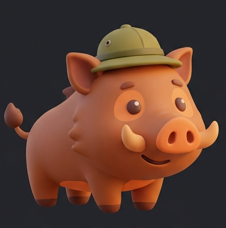

# BOAR — Best Offline AI Researcher (Android)

<br clear="left" />

A fully offline research assistant for Android: local LLM inference (`llama.cpp`
via `llama.rn`) + local hybrid retrieval (SQLite FTS5 + on-device embeddings).
First launch does a one-time model download (the app's only required network
use); after that it works completely offline. Built for the "Best Offline AI
Research App" community bounty.

- ≤ 12GB peak RAM
- ≤ 50GB total on-disk footprint (app + model weights + indexes)
- Works completely offline after a one-time first-run model setup
- Runs on GrapheneOS / no GMS dependency
- Real Android device, not just emulator
- Import your own documents (.txt/.md/.csv/.json) into the local knowledge
  base, toggle or delete them per-collection, and export/share a collection
  as a portable JSON pack — see [Custom knowledge base](#custom-knowledge-base) below
- Search Hugging Face for additional GGUF models beyond the curated default
  list, and download them the same way — see
  [Finding more models](#finding-more-models) below

See [ARCHITECTURE.md](./ARCHITECTURE.md) for the design (including exactly how
first-run model setup works and why network permission is present but unused
during chat/inference) and [docs/MODELS.md](./docs/MODELS.md) for the exact
models/datasets/indexes used.

## Status

🚧 Core app, RAG pipeline, and model selection are done and verified. EAS
Build is configured and the project is linked for cloud builds without a
local Android SDK. Not yet verified with an actual compile + install on real
hardware — see open items below.

## Quickstart

```bash
git clone https://github.com/rferrari/boar-app.git
cd boar-app
npm install

# Build via EAS (no local Android SDK needed) — see eas.json
npx eas-cli build --platform android --profile preview

# OR build locally if you have the Android SDK set up:
npx expo prebuild -p android --clean
npx expo run:android
```

### Quickstart with Make

The same steps, via a `Makefile` (`make help` lists all targets):

```bash
git clone https://github.com/rferrari/boar-app.git
cd boar-app
make setup         # npm install — also checks whether you have the Android SDK
make run-android   # local build — needs the Android SDK (make setup told you if you have it)
# or: make build-eas   # cloud build via EAS, no local Android SDK needed
```

On first launch, the app shows a one-time setup screen that downloads the
default models (~2.3GB, see `docs/MODELS.md`) — the only time it needs
network access. From then on it works fully offline, airplane mode included.
An in-app "Models" screen lets you optionally download additional/alternate
models later when you do have connectivity — see
`src/ui/ModelSetupScreen.tsx`, the only place in the app that touches the
network.

## Custom knowledge base

Settings > Knowledge Base has an "Import" card alongside the built-in
downloadable corpus packs. It lets you index your own notes into the same
local FTS5 + vector search used everywhere else in the app:

- **Supported formats:** `.txt`, `.md`, `.csv` (naive comma-split, no quoted-field
  escaping), `.json` (either the app's own `{title, source, body}[]` corpus-pack
  shape, or any other JSON — imported as raw text otherwise). **PDF is not
  supported** — there's no pure-JS PDF text extractor reliable enough for
  real-world (compressed-stream) PDFs to run in Hermes, and a native PDF
  library would reintroduce the native-dependency/rebuild risk this project
  has otherwise avoided. Convert a PDF to text/markdown first.
- Each import is chunked (~500 tokens, 50-token overlap, heuristic
  char-based split) and embedded on-device with the same embedding model used
  for the rest of the knowledge base, then saved as a named, toggleable
  collection — turn one off without deleting it, or delete it outright.
- **Export** re-serializes a collection as `{title, source, body}[]` JSON (the
  same shape as the bundled corpus packs) and hands it to the Android share
  sheet — send it over Bluetooth, Nearby Share, a file manager, whatever the
  recipient's device offers. This is deliberately *not* a raw `.sqlite`
  export: that would bake in this device's specific embedding vectors, which
  are meaningless (or the wrong dimension) on a phone running a different
  embedding model. A recipient re-embeds the JSON locally by importing it the
  same way.
- Everything happens on-device; nothing is uploaded anywhere.

## Finding more models

Settings > Tone & Model has a "Find more models" search box (below the
curated model list) that searches Hugging Face for other GGUF models —
`src/services/modelBrowser.ts` calls Hugging Face's public API, this is the
app's only other network access besides the model-setup downloads, and only
happens when you explicitly search. Tapping a result's file adds it to the
model list above, where you download it through the normal flow (same
progress tracking and post-download size check as every built-in model).

This is deliberately separate from the curated `MODEL_CATALOG` in
`src/models/manifest.ts`: nobody has run these models to confirm they fit
typical phone RAM or work cleanly in `llama.rn`, so check a model's Hugging
Face page yourself (size, license, quantization) before downloading. When
Hugging Face's metadata includes a git-lfs checksum it's kept on the
resulting catalog entry, but — like the rest of the app — only file size is
verified automatically after download, not a full sha256 (reading a
multi-gigabyte file into memory for a hash isn't worth doing on every
download; see `ModelManager.verifyChecksum`'s doc comment).

## Recovering from a bad model load, or starting over

If a model fails to load (corrupted/truncated download, the file went
missing, etc.) the chat screen shows a readable diagnosis instead of a raw
error, with shortcuts to Settings or straight back into the setup wizard —
see `src/ui/ModelLoadErrorCard.tsx`.

Settings > App also has:

- **Re-run Setup Wizard** — jump back into first-run setup any time to
  switch model tiers or re-download the defaults, without losing anything
  else.
- **Danger Zone > Clear All Data & Reset App** — a double-confirmed full
  wipe (`src/services/appReset.ts`): deletes every downloaded model, the
  whole local knowledge base (bundled + downloaded corpus packs + your own
  imported collections), and all chat history/settings, then sends you back
  to the setup wizard. This app doesn't use MMKV/AsyncStorage — persisted
  state is either the SQLite knowledge base or small JSON files under the
  app's document directory, and this is what actually gets cleared.

## Development

```bash
npm install
npx expo prebuild -p android --clean   # regenerates ./android (gitignored) from app.json
npx expo run:android                   # build + launch on a connected device
```

`--clean` matters any time `app.json`/assets change (app name, icon, plugins): without it,
prebuild can leave a stale `android/` project around with the old values baked in — that's
what a plain `npm install` alone will never fix, since it never touches `android/` at all.

## Open items

See [SUBMISSION_CHECKLIST.md](./SUBMISSION_CHECKLIST.md) for what's left before
this can be submitted.

## License

See [LICENSE](./LICENSE).
