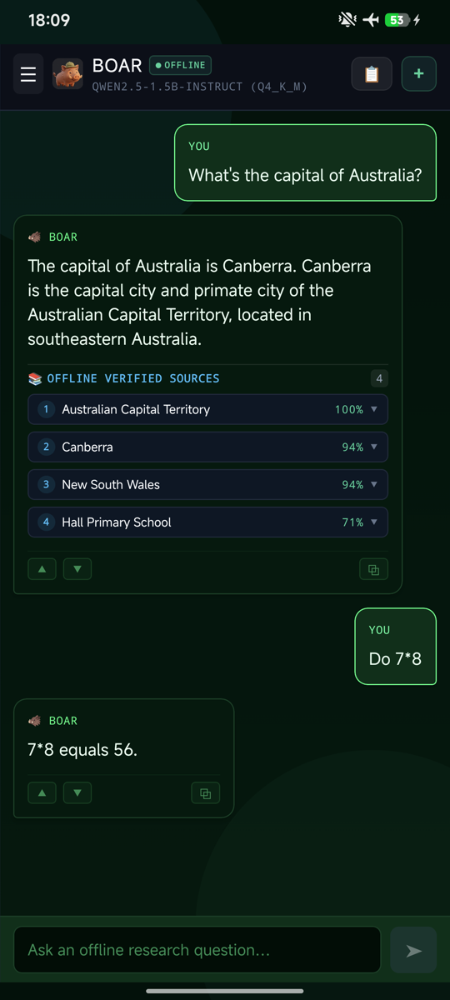
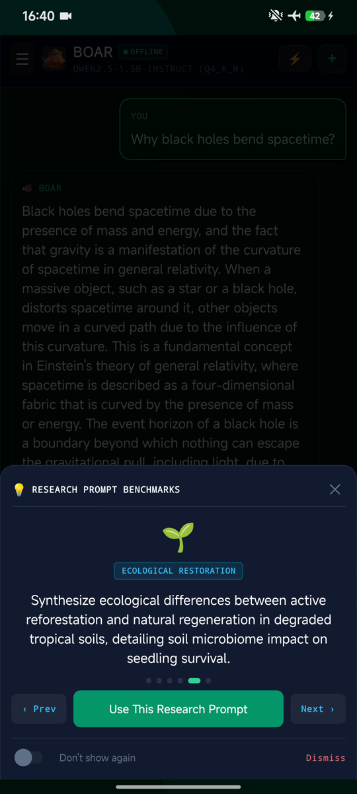
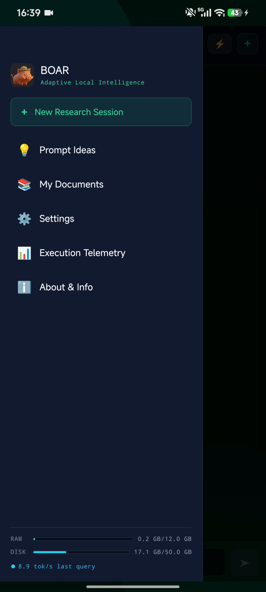
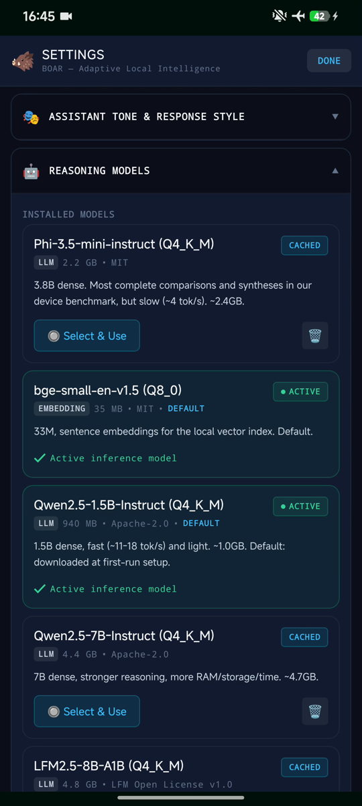
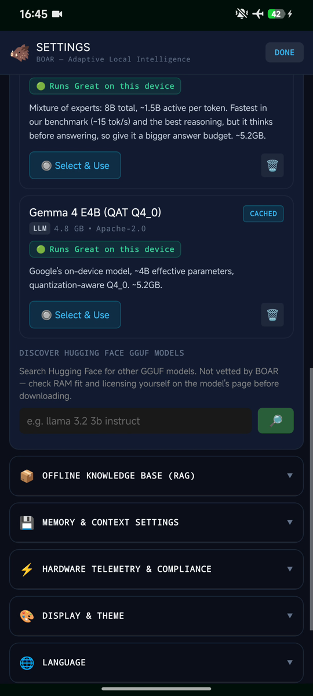
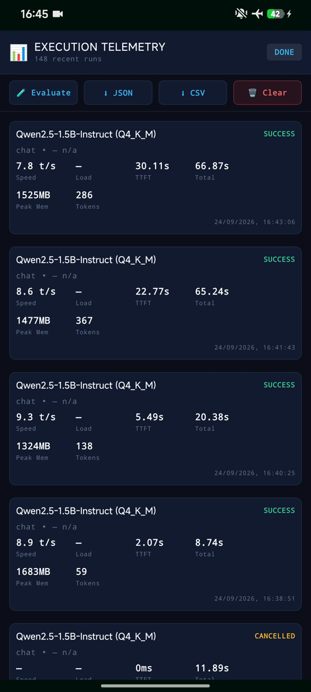
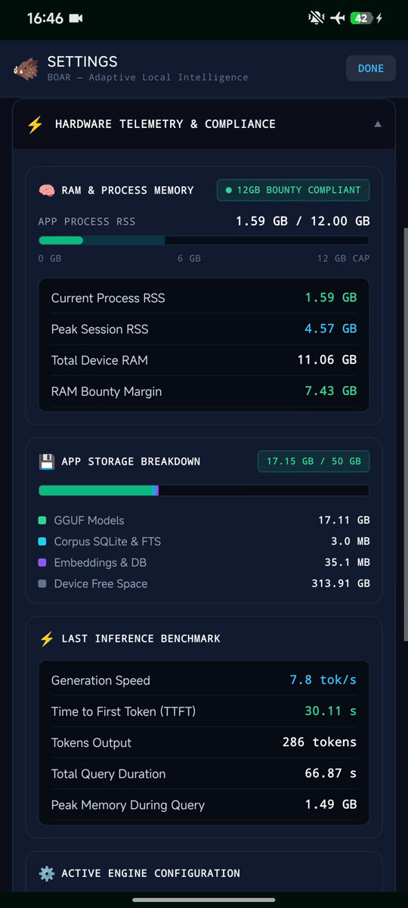
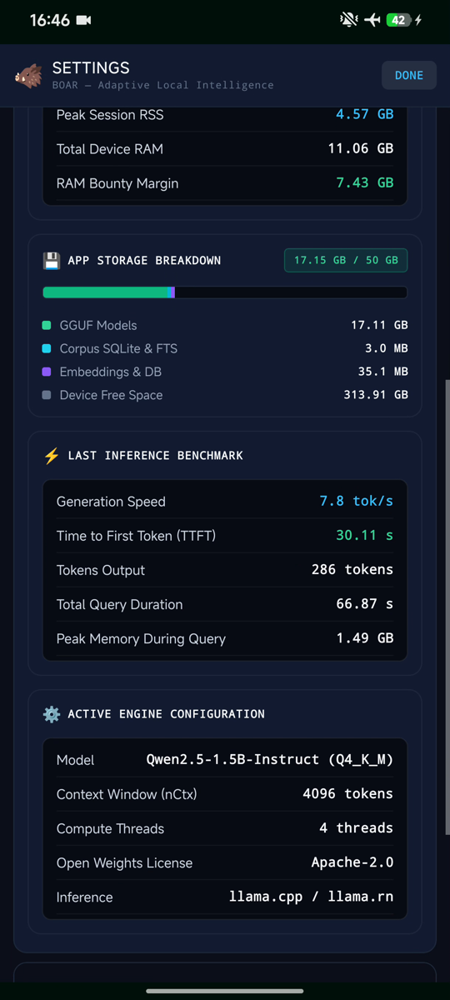

# BOAR demo

Recorded on a Xiaomi phone (MediaTek Dimensity, 12 GB RAM) in airplane mode, with
the default model, Qwen2.5-1.5B-Instruct (about 1 GB). Nothing leaves the phone.

## Videos

| Clip | What it shows | Length |
|---|---|---|
| [1. Offline, first question](1-offline-first-question.mp4) | Airplane mode on, a question answered with sources from the offline library | 0:35 |
| [2. A research prompt](2-prompt-idea.mp4) | A ready-made prompt from Prompt Ideas: a synthesis question across topics | 1:17 |
| [3. Follow-up](3-follow-up-context.mp4) | "interesting, continue": the answer picks up from the conversation so far | 1:21 |
| [4. Facts and math](4-facts-and-math.mp4) | The capital of Australia from the Wikipedia Vital Articles pack, then 7×8 | 0:38 |

The whole walkthrough in one file: [boar_demo_small.mp4](boar_demo_small.mp4) (4:01).

## Screenshots

<table>
<tr>
<td width="33%"></td>
<td width="33%"></td>
<td width="33%"></td>
</tr>
<tr>
<td><b>Answers with sources.</b> Every answer lists the offline articles it used and how well each matched. The OFFLINE badge and the airplane icon are real.</td>
<td><b>Prompt Ideas.</b> Ready-made research questions to try the app with.</td>
<td><b>Menu.</b> Past sessions, your own documents, settings and telemetry. RAM and disk use are always visible at the bottom.</td>
</tr>
<tr>
<td></td>
<td></td>
<td></td>
</tr>
<tr>
<td><b>Models.</b> The default model and the embedding model, plus optional ones you can switch to with one tap.</td>
<td><b>Bring your own model.</b> Mixture-of-experts and Gemma models tested on this phone, and a search for any GGUF model on Hugging Face.</td>
<td><b>Execution telemetry.</b> Every answer is measured: tokens per second, time to first token, peak memory. Export as JSON or CSV.</td>
</tr>
<tr>
<td></td>
<td></td>
<td></td>
</tr>
<tr>
<td><b>Memory and storage.</b> The app's RAM use against the 12 GB limit, and its storage against the 50 GB budget.</td>
<td><b>Engine.</b> The last answer's numbers and the model, context size, threads and license in use (llama.cpp through llama.rn).</td>
<td></td>
</tr>
</table>

## Measured on the phone

Six knowledge questions with the default 1.5B model and the Vital Articles pack
(`npm run eval:device`, 2026-09-24): 6 of 6 answered correctly, all from retrieved
articles, about 10.6 s per answer (6.4 s to the first word, 17.5 tokens/s), 1.76 GB
peak memory. See [DEVICE_EVALUATION.md](../DEVICE_EVALUATION.md) to run it yourself.
